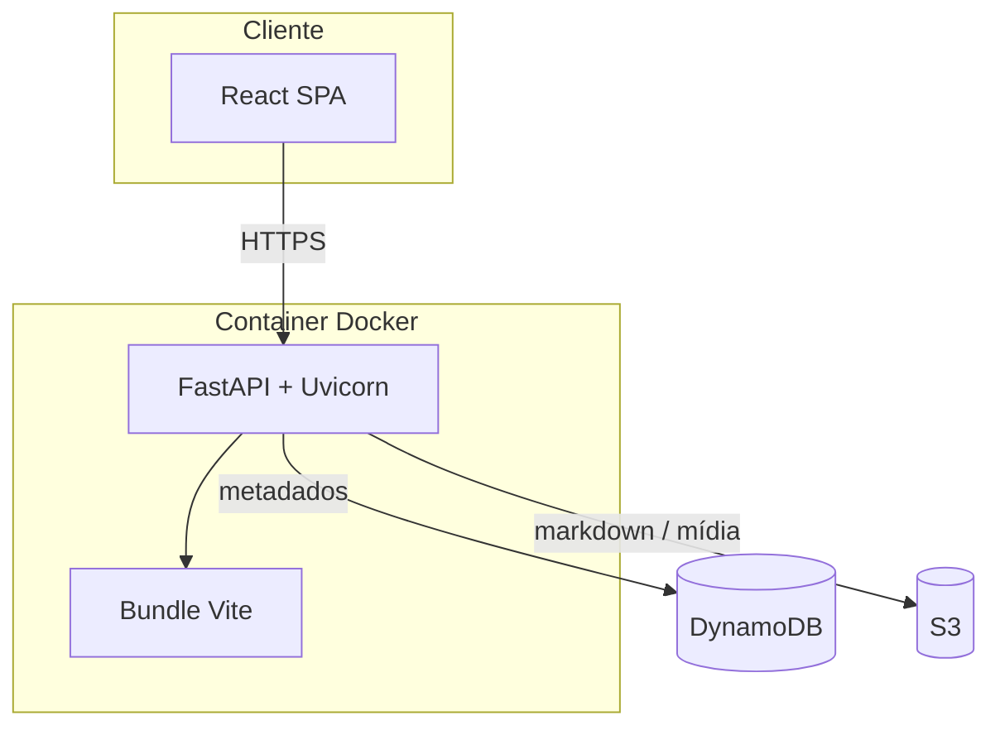
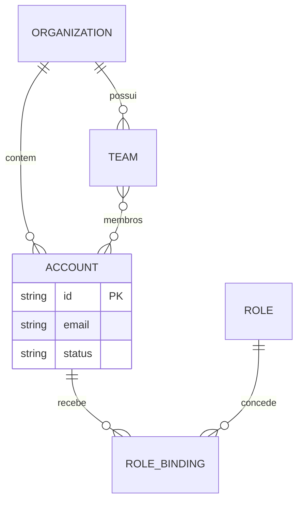
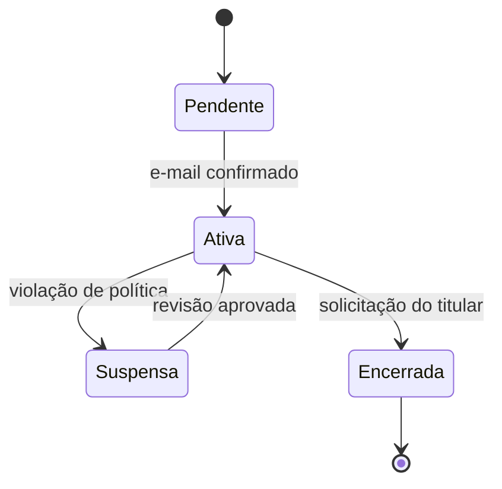

# Arquitetura

## Componentes

```mermaid
flowchart TB
    subgraph Cliente
      SPA[React SPA]
    end
    subgraph Servidor["Container Docker"]
      API[FastAPI + Uvicorn]
      Static[Bundle Vite]
    end
    SPA -- HTTPS --> API
    API --> Static
    API -- metadados --> DDB[(DynamoDB)]
    API -- markdown / mídia --> S3[(S3)]
```

## Modelo de dados

```mermaid
erDiagram
    ORGANIZATION ||--o{ TEAM : possui
    ORGANIZATION ||--o{ ACCOUNT : contem
    TEAM }o--o{ ACCOUNT : membros
    ACCOUNT ||--o{ ROLE_BINDING : recebe
    ROLE ||--o{ ROLE_BINDING : concede
    ACCOUNT {
        string id PK
        string email
        string status
    }
```

## Ciclo de vida de uma conta

```mermaid
stateDiagram-v2
    [*] --> Pendente
    Pendente --> Ativa: e-mail confirmado
    Ativa --> Suspensa: violação de política
    Suspensa --> Ativa: revisão aprovada
    Ativa --> Encerrada: solicitação do titular
    Encerrada --> [*]
```
